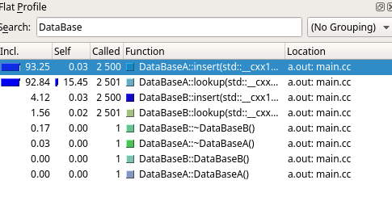
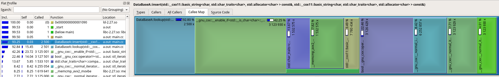
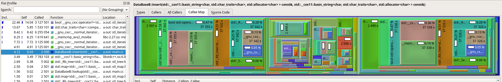
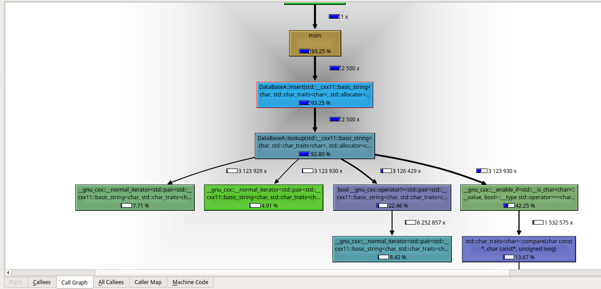

# Profiling Tutorial
This is a minimal and short tutorial that demonstrates profiling with valgrind and visualizing using kcachegrind.

## Prerequisites
Please make sure you have installed:
- Build environment for c++ (g++ etc)
- valgrind 
- kcachegrind
- wget

The last three can be installed in ubuntu using apt:
```
sudo apt install valgrind kcachegrind wget
```

## The demo program
We need some code to profile. 
[Here](https://github.com/michaelpantic/tutorials/blob/master/valgrind/res/profile_example.cc) you can find a simple demo program that stores the favourite food for a person given a name.
Please familiarize yourself with the source code.
Essentially, it generates a large list of people and assigns a favourite food. 
To do so, there are two different implementations (A and B) that are run simultaneously.

The goal of this tutorial is to use the profiler to find out which one is more efficient.

To download and compile, you can execute the following commands in a folder of your choice:
```
wget https://michaelpantic.github.io/tutorials/valgrind/res/profile_example.cc
g++ -std=c++11 profile_example.cc  -o profile_example
```

You should now have an executable called 'profile_example' that gives the following output when executed with `./profile_example`:
```
Simple profiling example!
Hans1250: beer
Hans1250: beer
```

So the favourite food of person "Hans1250" is beer according to both implementations. 

You can also play around with the `num_people` variable. You'll see that it scales really bad for large numbers.

So, what is the slow part?

## Running the profiler
In order to execute the program with the profiler, run it as follows:
```
valgrind --tool=callgrind ./profile_example 
```
It probably runs suuper slow and produces a bit more output than usual:
```
==17361== Callgrind, a call-graph generating cache profiler
==17361== Copyright (C) 2002-2017, and GNU GPL'd, by Josef Weidendorfer et al.
==17361== Using Valgrind-3.13.0 and LibVEX; rerun with -h for copyright info
==17361== Command: ./profile_example
==17361== 
==17361== For interactive control, run 'callgrind_control -h'.
Simple profiling example!
Hans1250: beer
Hans1250: beer
==17361== 
==17361== Events    : Ir
==17361== Collected : 445523261
==17361== 
==17361== I   refs:      445,523,261
```

You'll also note that it created a new file called "callgrind.out.$(pid number)". That is the output file of the profiler.

To visualize this file using kcachegrind, simply run the following (here, pid number was 17361):
```
kcachegrind callgrind.out.17361
```

## Interpreting the results
On the left, you'll see a flat list of all functions called.
The column "incl." show the relative amount of cpu cycles spent in that function. 
Note that these numbers are recursive and include all child function cycles (thus, main() will always be almost 100%).
The column "(called)" shows the amount of function calls for that function.

You can also search by name in the flat profile.
E.g. by searching for "DataBase", we only see functions of our two classes "DataBaseA" and "DataBaseB":

[](./img/database_flat.png)

Despite the fact that the two implementations do the exact same thing, DatabaseA inserts are where 93% of the runtime are spent!
DatabaseB calls are in comparison almost negligible.
Also note that DataBaseA lookups also happen inside the insert (that's why they both have a high percentage).


## Callee Map
There are a bunch of other very useful views. 
One is the so called callee map, that shows a graphical overview of the CPU time spent by subfunctions ("callee").
By selecting a specific function on the left side, we see that functions callee map.
Example, to compare the insert function of A and B:

Insert of DataBaseA:
[](./img/callee_map_A.png)
We see that almost all time of insert A is spent in the lookup function. 
The blue block encompasses almost all other blocks. The big green block (also part of lookup) are c++ library functions used for the iterator in the lookup.
Such large blocks are always a good hint at things that are inefficient. Unless there is a reason why the block is so large (e.g. large memory op).

In comparison, insert of DataBaseB:
[](./img/callee_map_B.png)
Insert B is already really fast (compared to insert A). And it is made up of many little blocks.
Here it would be much harder to decide what to optimize.

## Call Graph
Another useful view ist the call graph:

[](./img/callgraph_main.png)

It shows the heaviest subfunctions for each function in a graph hierarchical way, and how many times these have been called.
Here we easily see that DataBaseA inserts mostly spent time in DatabaseA lookups, and that those spent a lot of time iterating (it called the iterator 3 million times!).

## A few hints on optimization of code
The by faaaar most important thing to know about optimization is the following quote:

```
premature optimization is the root of all evil (or at least most of it) in programming

(attributed to Donald Knuth)
```

Which translates to the following:
- Don't start optimizing from the beginning. Only if necessary
- Don't optimize the little things where only little efficiency is lost. Target the large gains!!

At the same time, keep the following in mind:
- Don't write stupid code from the beginning. For many many algorithm problems C++ has standard implementations.
- Unless you exactly exactly know what you are doing, your implementations are guaranteed to be slower than the default ones. Never implement a sort algorithm by yourself, don't rewrite Eigen, don't rewrite opencv etc.
- Think about where your data is copied and passed around! Understand why something might be expensive
- If you have to write a lot of loops to search/check something, there is probably a more efficient way (indexing, different data structure etc.) 
- Learn to use the correct datastructures! This alone saves sooo much trouble.

## What was wrong with DataBaseA?
So, why was DataBaseA so slow?
Because we used the wrong datastructure.
For each lookup, we had to iterate through the whole list. For each insert we had to lookup to check if the entry was already there.
That means, for the insert number 10000, we have to go through 9999 previous entries and so on.

This gives as approximately quadratic scaling. With 2500 entries, we expect 2500*2500/2 lookups - roughly the 3.1 million iteration accesses we saw earlier.

In contrast, DatabaseB used a `map`, which uses indexes and can find entries in linear time.
See [here](https://en.wikipedia.org/wiki/Hash_table).

DatabaseB could probably handle millions of entries, while DatabaseA becomes computationally intractable very fast.


## Profiling with ROS
How to start a rosnode with a profiler? see here: [link](http://wiki.ros.org/roslaunch/Tutorials/Profiling%20roslaunch%20nodes) 


